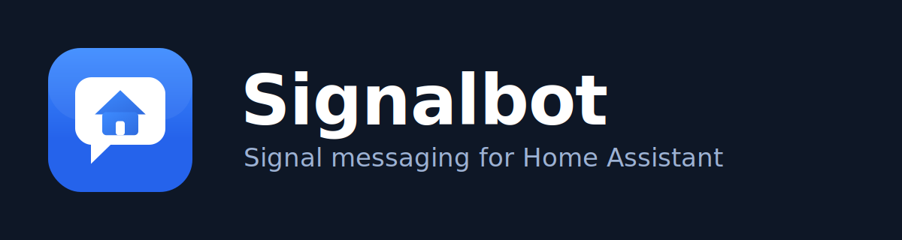

<div align="center">



&nbsp;

[](https://github.com/hacs/integration)
[](signalbot/CHANGELOG.md)
[](custom_components/signalbot)

**Send and receive [Signal](https://signal.org) messages directly from Home Assistant — link by QR, whitelist senders with one click, and drive automations from incoming messages.**

</div>

This repository ships **two components that work together**:

1. A **Home Assistant Add-on** (`signalbot/`) — bundles `signal-cli-rest-api` and a setup/management web UI. Handles Signal account linking and chat-partner management for you.
2. A **HACS custom integration** (`custom_components/signalbot/`) — auto-discovered once the add-on is running. Creates notify entities, sensors, and events in Home Assistant.

---

## How it works

```
Signal network
     |
     v
[ signal-cli-rest-api ]  <-- bundled inside the Signalbot Add-on
     |
     v
[ Add-on Web UI ]  -- QR linking, recent messages, chat-partner management
     |                  (single receiver of all incoming Signal messages)
     | Supervisor discovery (automatic)
     v
[ Signalbot Integration ]  -- notify entities, sensors, events
     |
     v
Home Assistant automations & scripts
```

- The **add-on** runs `signal-cli-rest-api` internally so you do not need to manage it yourself.
- On first run the add-on Web UI shows a **QR code**. Scan it with the Signal app to link Home Assistant as a linked device.
- The add-on is the **single receiver** of all incoming Signal messages. It buffers them for the Web UI's recent-messages list and delivers them to the integration — there is no separate polling of signal-cli by the integration.
- Chat partners are added in the add-on Web UI — either by clicking **"Add as chat partner"** next to a recent sender (recommended) or by entering their name and number manually.
- The add-on announces itself to HA via **Supervisor discovery** — no manual URL entry is needed.
- The integration creates one `notify.signalbot_<name>` entity per chat partner, two sensors, and fires a `signalbot_message_received` event for incoming messages.
- Only messages from **configured chat partners** trigger the event (togglable in the add-on UI).

---

## Requirements

- **Home Assistant OS** or **Home Assistant Supervised** (required for add-ons).
- The Signalbot HACS integration installed alongside the add-on.

> **HA Container / Core users:** Add-ons are not available on these installs. You would need to run `signal-cli-rest-api` yourself and configure the integration manually. The add-on path (HA OS / Supervised) is the fully supported and documented setup.

---

## Installation

Install both parts in order. The add-on provides the Signal backend; the integration wires it into Home Assistant entities and events.

### 1. Add-on

1. In Home Assistant go to **Settings → Add-ons → Add-on Store**.
2. Click the three-dot menu (top-right) and choose **Repositories**.
3. Add `https://github.com/sahelea1/ha-hacs-integration-signalbot` and click **Add**.
4. Search for **Signalbot** in the store and click **Install**.
5. Click **Start** to start the add-on.

### 2. Integration (via HACS)

1. Open **HACS → Integrations**.
2. Click the three-dot menu and choose **Custom repositories**.
3. Add `https://github.com/sahelea1/ha-hacs-integration-signalbot` with category **Integration**.
4. Search for **Signalbot** and click **Download**.
5. **Restart Home Assistant.**

Once HA restarts with the add-on already running, Supervisor discovery surfaces the integration automatically. Confirm it under **Settings → Devices & Services**.

---

## First-run setup

1. Open the **Signalbot** add-on page and click **Open Web UI**.
2. A QR code is displayed. On your phone open **Signal → Settings → Linked devices → Link new device** and scan it.
3. Once linked, the Web UI switches to show **Chat partners**, **Recent messages**, and **Settings**, and the status pill shows "Connected as +49…".
4. Add chat partners — the easiest way is to have someone send you a Signal message and then click **"Add as chat partner"** next to their entry in the **Recent messages** card (see below). You can also add partners manually in the **Chat partners** section by entering a friendly name and E.164 number (e.g. `+4915123456789`) and/or Signal username.
5. In Home Assistant, go to **Settings → Devices & Services**. The Signalbot integration should appear as discovered — click **Add** to confirm.

---

## Whitelisting senders via the Recent messages card

After linking, any Signal message sent to your linked account appears in the **Recent messages** card in the Web UI (showing the sender's number, name, and last message). To whitelist a sender:

1. Open the add-on **Web UI**.
2. Find the sender in the **Recent messages** card.
3. Click **"Add as chat partner"**.

This creates a chat partner with the sender's **exact number** as stored by Signal — which is what makes incoming-message matching reliable. No need to type an E.164 number by hand or look it up.

**Why this matters:** the known-senders allowlist (on by default) silently ignores messages from any sender whose number is not in your chat-partner list, and the match is exact. Typing a number incorrectly — even a format difference — means messages are dropped without any error. Clicking to whitelist eliminates this risk.

Once a chat partner is saved, the integration:
- Automatically creates a `notify.signalbot_<name>` entity for them.
- Fires the `signalbot_message_received` event for future messages from them, making automations and triggers work immediately.

---

## Usage

### Sending messages

#### Via a per-partner notify entity

Each chat partner becomes a `notify.signalbot_<name>` entity. Use it directly in automations:

```yaml
- service: notify.signalbot_alice
  data:
    message: "Motion detected in the hallway!"
```

#### Via the `signalbot.send_message` service (multi-recipient + attachments)

`recipients` accepts a configured chat-partner **name** (case-insensitive), an **E.164 phone number**, a **Signal username** (prefix `u:`), or a **group ID** (prefix `group.`):

```yaml
- service: signalbot.send_message
  data:
    message: "Hello from Home Assistant 👋"
    recipients:
      - "Alice"
      - "+4915123456789"
    attachments:            # optional — pass base64-encoded file data as strings
      - "<base64-string>"
```

---

### Reacting to incoming messages

Every incoming text message from a known sender fires the **`signalbot_message_received`** event. Event data fields:

| Field | Description |
|---|---|
| `source` | Sender's phone number (E.164) |
| `source_uuid` | Sender's Signal UUID |
| `source_name` | Sender's display name (if known) |
| `message` | Full message text |
| `timestamp` | Unix timestamp of the message |
| `recipient_id` | Internal recipient identifier |
| `recipient_name` | Friendly name of the configured chat partner |
| `command` | First token lowercased if message starts with `/`, otherwise `null` |
| `command_args` | Remainder of the message after the command token, or `null` |
| `config_entry_id` | ID of the Signalbot config entry |

**`command` parsing:** if the message text starts with `/`, the integration splits it into a command and arguments. For example, the message `/lights off` produces `command: "/lights"` and `command_args: "off"`. This makes it easy to build a simple command dispatcher without string parsing in templates.

#### Example 1 — Echo every incoming message back to the sender

```yaml
automation:
  alias: "Signal — echo reply"
  trigger:
    - platform: event
      event_type: signalbot_message_received
  action:
    - service: notify.signalbot_alice
      data:
        message: "You said: {{ trigger.event.data.message }}"
```

#### Example 2 — Respond to a `/status` command

```yaml
automation:
  alias: "Signal — /status command"
  trigger:
    - platform: event
      event_type: signalbot_message_received
      event_data:
        command: "/status"
  action:
    - service: signalbot.send_message
      data:
        message: "House is armed. Temp: {{ states('sensor.living_room_temperature') }}°C"
        recipients:
          - "{{ trigger.event.data.source }}"   # reply to whoever asked
```

#### Example 3 — Act only on messages from a specific sender

Filter by `recipient_name` (the friendly name you gave the chat partner) or by `source` (the sender's E.164 phone number):

```yaml
automation:
  alias: "Signal — only from Alice (by partner name)"
  trigger:
    - platform: event
      event_type: signalbot_message_received
      event_data:
        recipient_name: "Alice"   # matches the friendly name set in the add-on UI
  action:
    - service: light.turn_on
      target:
        area_id: living_room
```

```yaml
automation:
  alias: "Signal — only from a specific number"
  trigger:
    - platform: event
      event_type: signalbot_message_received
      event_data:
        source: "+4915123456789"  # match by sender phone number
  action:
    - service: light.turn_on
      target:
        area_id: living_room
```

Only messages from **configured chat partners** fire the event (known-senders allowlist). Toggle this behaviour in the add-on Web UI.

---

### Sensors

| Entity | Description |
|---|---|
| `sensor.signalbot_last_message` | Text of the most recently received message. Attributes include `source`, `source_name`, `command`, `command_args`, and more. |
| `sensor.signalbot_link_status` | Account link state: `linked`, `unlinked`, or `error` |

> **Dashboard tip:** `sensor.signalbot_last_message` is a handy alternative to event-based automations when you just want to display the last incoming message on a Lovelace card, or read it from a template sensor.

---

## Configuration

All runtime configuration — chat partners, the known-senders allowlist, and the receive poll interval — is managed in the **Signalbot add-on Web UI**. The add-on's **Configuration** tab also exposes a `mode` option for selecting the signal-cli execution mode (see the add-on docs for details).

---

## Troubleshooting

**Add-on is not auto-discovered**
- Make sure the add-on is running (green "Running" status on the add-on page).
- Confirm the HACS integration is installed and HA has been restarted after installing it.
- Check Settings → Devices & Services for a pending discovery entry.

**QR code does not appear or times out**
- Open the add-on log tab for error messages.
- Refresh the Web UI page. If the code still does not appear, restart the add-on.

**High CPU or RAM usage**
- Open the add-on **Configuration** tab and confirm `mode` is set to `native` (the default). The `native` mode uses a GraalVM binary and is significantly lighter than `normal` mode.
- Avoid leaving the Web UI open longer than needed — the UI polls status periodically.
- On 32-bit (`armv7`) hardware the add-on automatically falls back from `native` to `normal`.

**signal-cli is unreachable**
- The add-on bundles signal-cli-rest-api, so it starts automatically. Check the add-on log for startup errors.
- Ensure the add-on has network access (no unusual HA network restrictions).

**Re-linking the Signal account**
- On your phone, open **Signal → Settings → Linked devices**, tap the Home Assistant device and **remove** it.
- Reopen the add-on Web UI: once the account is no longer linked, the add-on automatically shows a fresh QR code to link again.

**Entities missing after adding a chat partner**
- Reload the integration: Settings → Devices & Services → Signalbot → three-dot menu → Reload.

For further help open an issue at [github.com/sahelea1/ha-hacs-integration-signalbot/issues](https://github.com/sahelea1/ha-hacs-integration-signalbot/issues).

---

## Disclaimer

Signalbot is an **unofficial, community-developed** project and is not affiliated with, endorsed by, or supported by Signal Messenger LLC or the Signal Foundation. Use it in accordance with Signal's [Terms of Service](https://signal.org/legal/).
